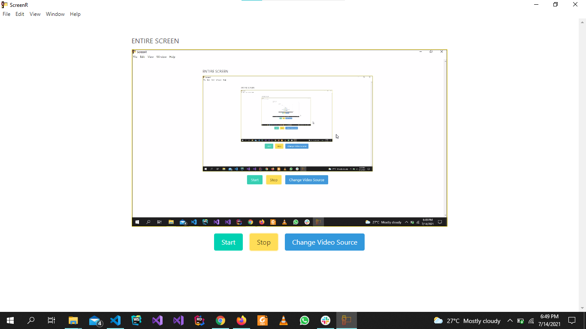
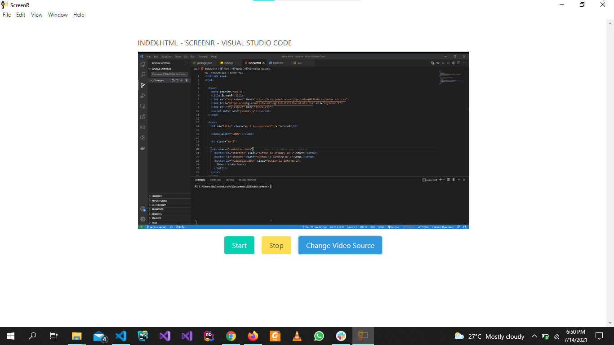
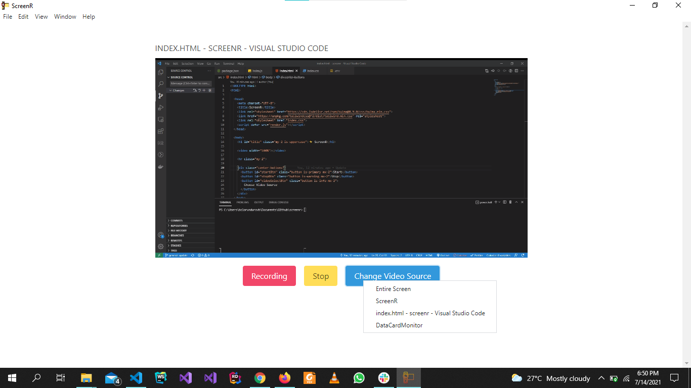
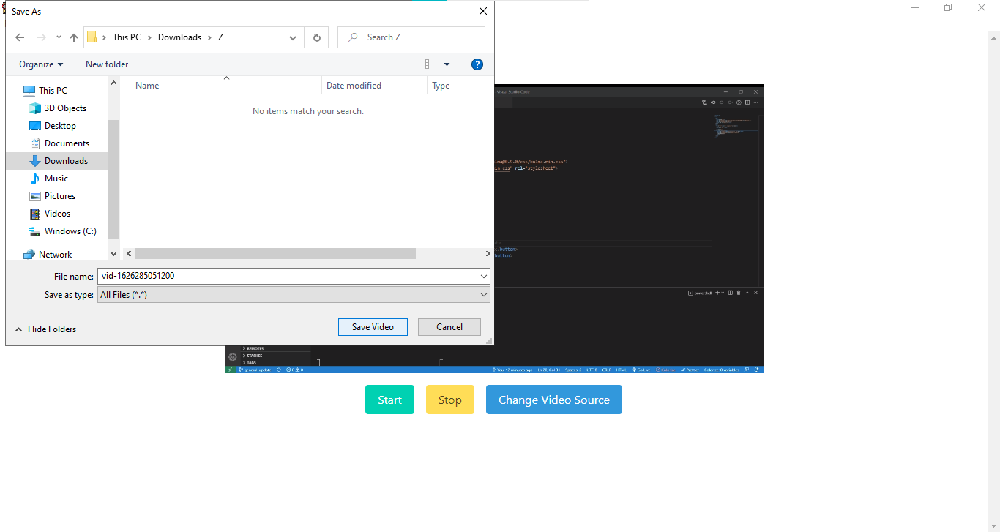

<h1 align="center">Welcome to screenr 👋</h1>
<p>
  <a href="https://www.npmjs.com/package/screen-record" target="_blank">
    
  </a>
  <a href="screen-recorder" target="_blank">
    
  </a>
  <a href="#" target="_blank">
    
  </a>
  <a href="https://twitter.com/bolorundurovb" target="_blank">
    
  </a>
</p>

> A Simple Desktop application for screen recording

### 🏠 [Homepage](https://github.com/bolorundurovj/screenr)

### ✨ [Demo](https://github.com/bolorundurovj/screenr)

## Install

```sh
npm install
```

## Usage

```sh
npm start
```

## Author

👤 **Bolorunduro Valiant-Joshua**

* Website: bolorundurovb.com
* Twitter: [@bolorundurovb](https://twitter.com/bolorundurovb)
* Github: [@bolorundurovj](https://github.com/bolorundurovj)
* LinkedIn: [@bolorundurovb](https://linkedin.com/in/bolorundurovb)

<div style="width:100%">
  
  
  
  
</div>

## Show your support

Give a ⭐️ if this project helped you!
