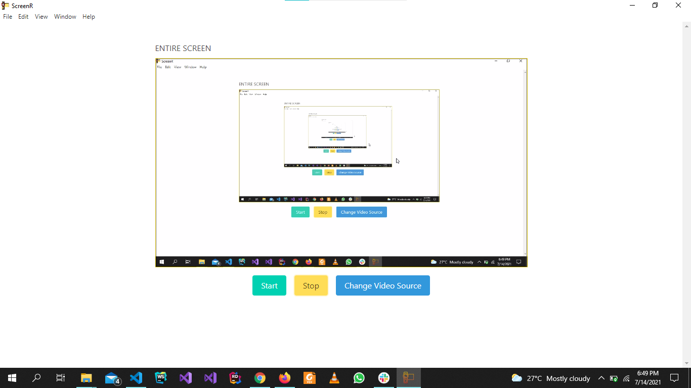
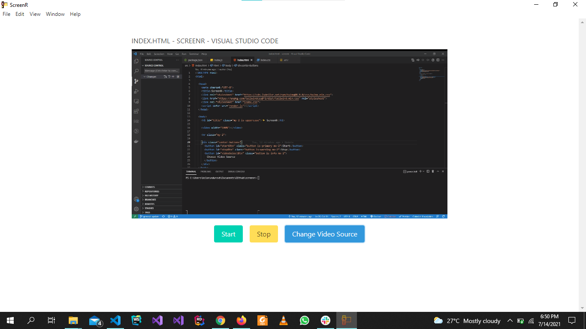
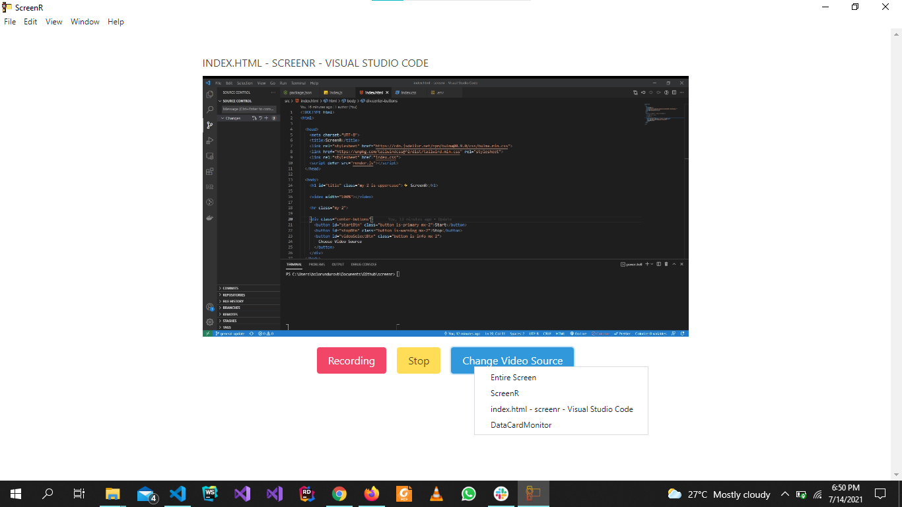
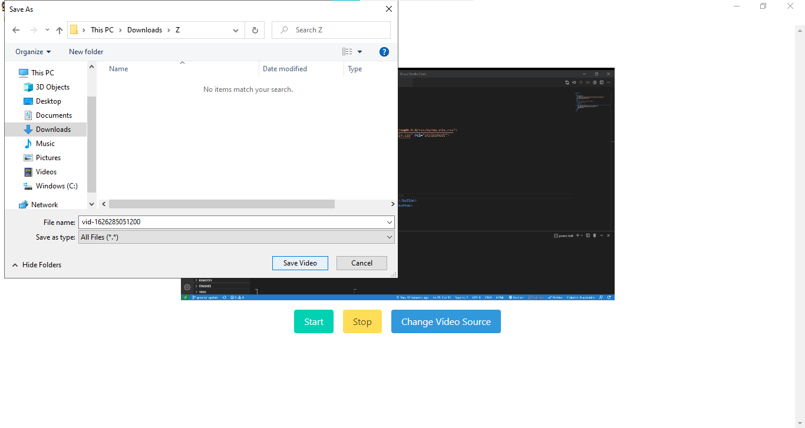

<h1 align="center">Welcome to screenr 👋</h1>
<p>
  <a href="https://www.npmjs.com/package/screen-record" target="_blank">
    
  </a>
  <a href="screen-recorder" target="_blank">
    
  </a>
  <a href="#" target="_blank">
    
  </a>
  <a href="https://twitter.com/bolorundurovb" target="_blank">
    
  </a>
  <a href="[https://twitter.com/bolorundurovb](https://github.com/bolorundurovj/screenr/releases)" target="_blank">
    
  </a>
</p>

> A Simple Desktop application for screen recording

Built with [Tauri](https://tauri.app) (Rust backend) and [Angular](https://angular.dev) (frontend).

### 🏠 [Homepage](https://github.com/bolorundurovj/screenr)

### ✨ [Demo](https://github.com/bolorundurovj/screenr)

## Prerequisites

- [Node.js](https://nodejs.org) (LTS)
- [Rust](https://www.rust-lang.org/tools/install) toolchain
- Platform [Tauri prerequisites](https://tauri.app/start/prerequisites/) (WebView2 on Windows, WebKitGTK on Linux)

## Install

```sh
yarn install
```

## Usage

Run the app in development (starts Angular and launches the Tauri window):

```sh
yarn tauri:dev
```

## Build

Produce the native installers/bundles:

```sh
yarn tauri:build
```

## Author

👤 **Bolorunduro Valiant-Joshua**

* Website: [bolorundurovb.tech](https://bolorundurovb.tech)
* Twitter: [@bolorundurovb](https://twitter.com/bolorundurovb)
* Github: [@bolorundurovj](https://github.com/bolorundurovj)
* LinkedIn: [@bolorundurovb](https://linkedin.com/in/bolorundurovb)

<div style="width:100%">
  
  
  
  
</div>

## Show your support

Give a ⭐️ if this project helped you!
